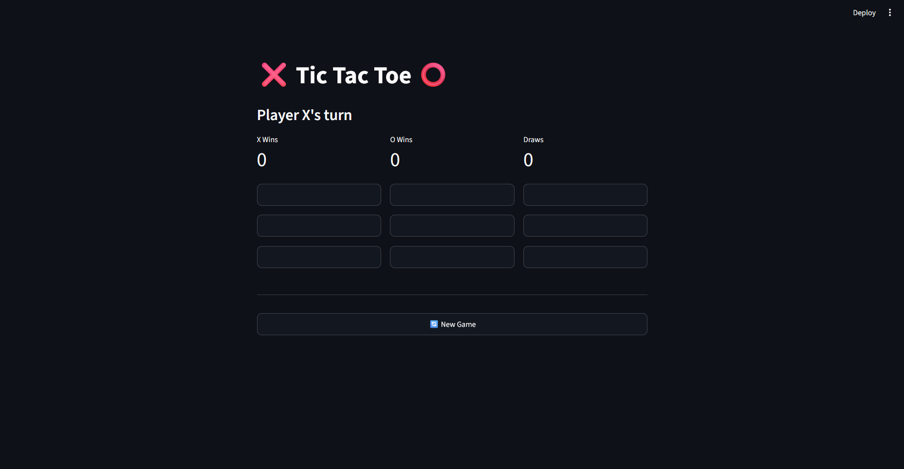
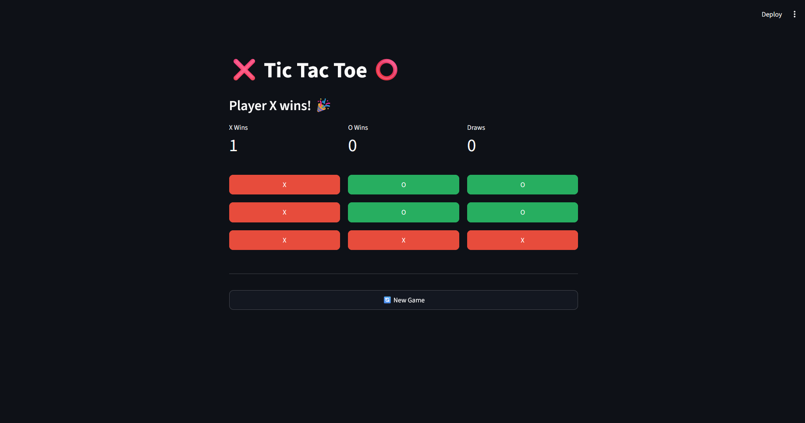
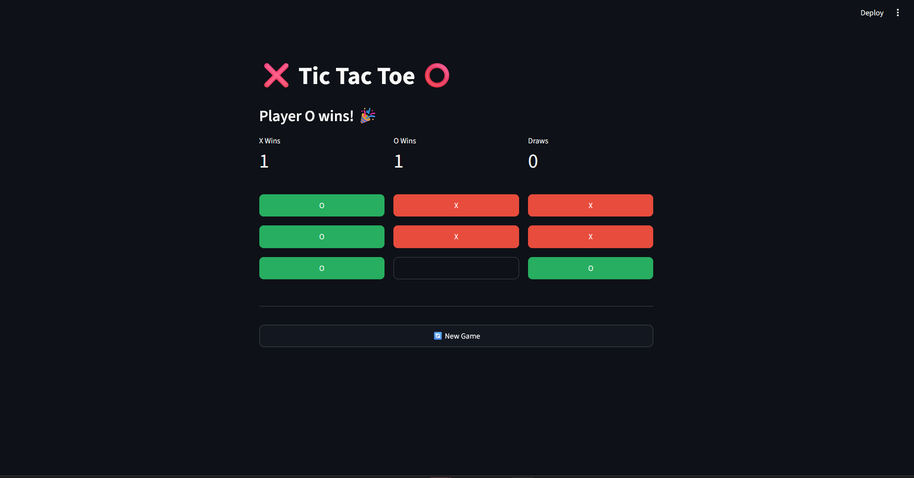
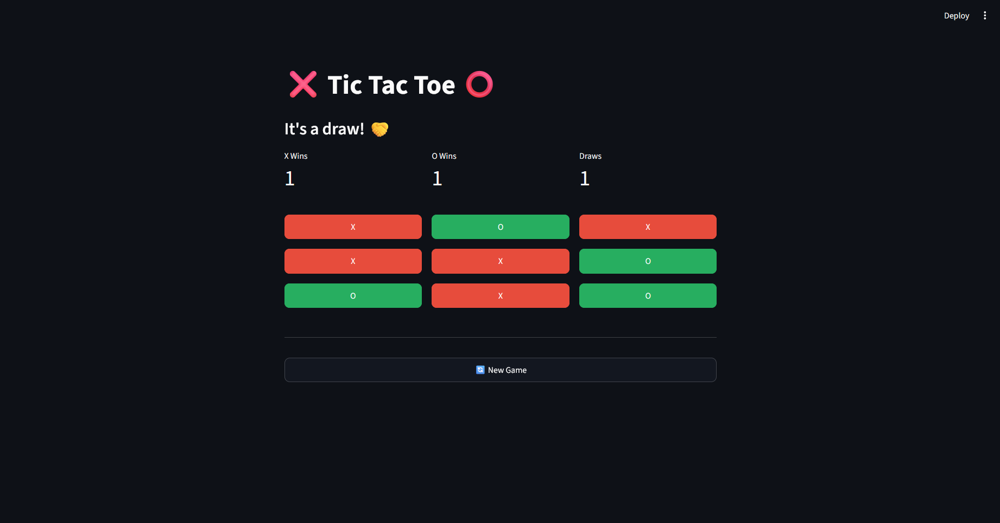
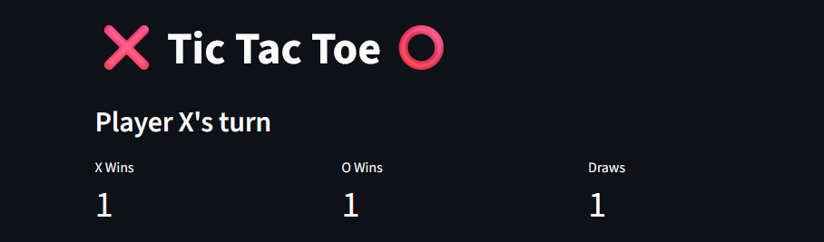

# 🎮 Tic Tac Toe Streamlit

### Interactive Tic Tac Toe — Modern Streamlit App with Live Scoreboard

**Tic Tac Toe Streamlit** is a clean, modern, and beginner-friendly web application built entirely in **Python** using **Streamlit**.

It provides a responsive two-player Tic Tac Toe experience with reusable UI components, session state management, automatic winner detection, and a live scoreboard.

Users can:

* ❌ Play as X and ⭕ O in turns
* 🏆 Detect wins and draws automatically
* 📊 Track scores without refreshing the app
* 🔄 Start a new game instantly
* 🧩 Experience a modular architecture built for learning and extension

All gameplay runs locally through Streamlit with no accounts or external services.

---

## ✨ Key Philosophy

### 1️⃣ Simplicity First
Play immediately with a clean interface and intuitive controls.

### 2️⃣ Modular Design
Game logic, state management and UI are separated into independent modules.

### 3️⃣ Learning Friendly
Designed as a reference project demonstrating clean Python architecture and Streamlit best practices.

---

## ✨ Features

* 🎮 Interactive Tic Tac Toe gameplay
* ❌⭕ Two-player turn management
* 🏆 Automatic win & draw detection
* 📊 Live scoreboard using Streamlit Session State
* 🔄 New Game reset
* 🧩 Modular architecture
* 📱 Responsive UI
* 🧪 Pytest unit tests

---

## 🎮 Gameplay

### Rules
* Two-player local game
* Players alternate between X and O
* First player to align three symbols wins
* Full board without a winner results in a draw

### Game Features
* Prevents overwriting occupied cells
* Displays winner instantly
* Draw detection
* Score persists during the session

---

## 📊 Scoreboard

* Live score updates
* Tracks X Wins
* Tracks O Wins
* Tracks Draws
* Reset with a new session

---

## 🖥️ User Interface

### Screens
* Main Game Board
* Live Scoreboard
* Winner / Draw Status

### Features
* Responsive layout
* Clean button grid
* Instant updates
* Beginner-friendly interface

---

## 📂 Project Structure

```
tic-tac-toe-streamlit/
│
├── assets/                # Screenshots/Icons
├── core/                   # Game logic — no Streamlit UI concerns
│   ├── __init__.py          # Empty File
│   ├── constants.py          # Win combinations, cell colours
│   ├── state.py               # session_state initialization
│   └── game.py                 # Move handling, win/draw detection, reset
├── gui/                         # Presentation layer
│   ├── __init__.py               # Empty File
│   ├── layout.py                  # Page scaffold (title, sections, reset button)
│   ├── board.py                    # 3x3 button grid
│   ├── scoreboard.py                # X/O/Draw score metrics
│   └── styles.py                     # Dynamic per-cell CSS injection
├── tests/                             # Game Testing 
│   └── test_game.py                    # End-to-end tests via Streamlit's AppTest
├── main.py                              # Entry point — wires state + UI together
├── requirements.txt                      # Runtime & Test dependency
├── LICENSE                                # MIT LICENSE
└── .gitignore
```

---

## 🧪 Tech Stack

| Component | Implementation |
|-----------|----------------|
| Language | Python |
| Framework | Streamlit |
| Testing | pytest |
| State Management | Streamlit Session State |

---

## 🚀 Getting Started

### 1️⃣ Clone Repository

```bash
git clone https://github.com/ShakalBhau0001/tic-tac-toe-streamlit.git
cd tic-tac-toe-streamlit
```

### 2️⃣ Install Dependencies

```bash
pip install -r requirements.txt
```

### 3️⃣ Launch Application

```bash
streamlit run main.py
```

---

## ⚠️ Important Notes

* Python 3.12+ recommended
* Runs completely locally
* Scores persist during the active session
* Includes automated tests

---

## 🛣️ Roadmap

* Single-player AI
* Difficulty levels
* Dark/Light themes
* Online multiplayer
* Match history

---

## ⚠️ Disclaimer

> **_Educational project for learning Python, Streamlit, modular architecture and software engineering concepts._**

---

## 📸 Preview

### 1. Main Game


### 2. Player `X` Winner


### 3. Player `O` Winner


### 4. Draw


### 5. Scoreboard


---

## 🪪 Author

> **Developer: Shakal Bhau**

> **GitHub: [ShakalBhau0001](https://github.com/ShakalBhau0001)**

---

> *"Clean architecture makes simple games great learning projects."*

---

## ⭐ Support

If you like this project, consider giving it a ⭐ on GitHub!

---
